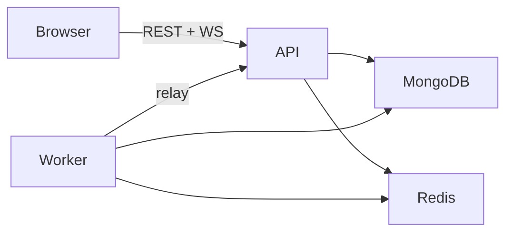

# Bike Auction Platform

Production-grade live motorcycle auction platform for a software engineering internship assignment. Users browse and bid on bikes in real time; admins manage inventory, schedules, and users.

**Stack:** React (Vite) · Node.js / Express · MongoDB · Redis · Socket.IO · BullMQ

## Features

- Live multi-auction bidding with atomic Redis updates and anti-sniping extensions
- Real-time bid feed via Socket.IO (rooms, snapshots, notifications)
- JWT auth (access + refresh), role-based admin APIs
- Watchlist and in-app notifications
- Prometheus metrics, structured logging, health/readiness probes
- GitHub Actions CI (lint, typecheck, integration tests)

## Prerequisites

- **Node.js** 20+
- **npm** 10+
- **MongoDB** — local via Docker *or* [MongoDB Atlas](https://www.mongodb.com/atlas) (recommended)
- **Redis** — local via Docker *or* [Upstash Redis](https://upstash.com/) (recommended; use `rediss://` URL)

Docker Desktop is optional (only needed for local Mongo/Redis containers).

## Quick Start (Cloud DBs — recommended)

### 1. Clone and configure backend

```powershell
cd backend
copy .env.example .env
npm install
```

Edit `backend/.env`:

- `MONGODB_URI` — Atlas connection string with database name `/bike_auction`
- `REDIS_URL` — Upstash `rediss://...` URL
- `JWT_ACCESS_SECRET` / `JWT_REFRESH_SECRET` — at least 32 random characters each

Generate secrets:

```bash
node -e "console.log(require('crypto').randomBytes(32).toString('hex'))"
```

### 2. Start API and worker (two terminals)

```powershell
# Terminal 1 — API
cd backend
npm run dev

# Terminal 2 — lifecycle jobs + notification delivery
cd backend
npm run worker
```

API: `http://localhost:3001`

### 3. Seed demo data (once)

```powershell
cd backend
npm run seed
```

**Demo accounts:**

| Role   | Email                  | Password    |
|--------|------------------------|-------------|
| Admin  | `admin@bikeauction.com` | `Admin123!` |
| Bidder | `bidder@example.com`    | `Bidder123!`|

### 4. Frontend

```powershell
cd frontend
copy .env.example .env
npm install
npm run dev
```

App: `http://localhost:5173`

### 5. Verify

```bash
curl http://localhost:3001/health
curl http://localhost:3001/health/ready
curl http://localhost:3001/v1
```

## Quick Start (Local Docker for Mongo + Redis)

```powershell
cd docker
docker compose up -d
```

Then set in `backend/.env`:

```
MONGODB_URI=mongodb://localhost:27017/bike_auction
REDIS_URL=redis://localhost:6379
```

Continue with API, worker, seed, and frontend steps above.

Optional full stack in Docker (API + worker + frontend + infra):

```powershell
docker compose -f docker/docker-compose.full.yml up --build
```

## Project Structure

```text
New Auction System/
├── backend/          # Express API, Socket.IO, BullMQ worker entry
├── frontend/         # React SPA (Vite + Tailwind)
├── docker/           # Compose files, Dockerfiles, nginx config
├── docs/             # Architecture, API, deployment, observability
└── .github/workflows # CI
```

## Scripts

| Command | Location | Description |
|---------|----------|-------------|
| `npm run dev` | backend | API with hot reload |
| `npm run worker` | backend | Auction lifecycle + notification workers |
| `npm run seed` | backend | Seed motorcycles, auctions, demo users |
| `npm run build` | backend / frontend | Production build |
| `npm start` | backend | Run compiled API (`dist/server.js`) |
| `npm test` | backend | All tests (needs Mongo + Redis) |
| `npm run lint` | backend | ESLint |
| `npm run seed:restore` | backend | Restore demo auctions with images (fixes test data wipe) |
| `npm run dev` | frontend | Vite dev server |
| `npm run build` | frontend | Static production build |

## Environment Variables

| File | Purpose |
|------|---------|
| `backend/.env.example` | API + worker configuration |
| `frontend/.env.example` | `VITE_API_URL`, `VITE_SOCKET_URL` |
| `.env.example` | Combined reference at repo root |

**Production:** set `CORS_ORIGIN` to your frontend URL and point `VITE_*` vars at your deployed API origin.

## Documentation

| Document | Description |
|----------|-------------|
| [Setup Guide](docs/SETUP.md) | Detailed local setup and troubleshooting |
| [Architecture](docs/architecture.md) | System design, data flows, folder layout |
| [API Contracts](docs/api-contracts.md) | REST endpoints and error codes |
| [Socket Events](docs/socket-events.md) | Real-time event catalog |
| [Deployment](docs/deployment.md) | Atlas, Upstash, Railway/Render, Vercel |
| [Observability](docs/observability.md) | Health, metrics, logging, CI |
| [Assumptions & Trade-offs](docs/assumptions-and-tradeoffs.md) | Design decisions |

## Architecture (summary)



- **HTTP** for bid placement (auth, idempotency, audit)
- **Socket.IO** for push updates only
- **Redis** for live auction state, rate limits, pub/sub adapter
- **MongoDB** for durable users, auctions, bids, audit logs
- **BullMQ worker** (separate process) for scheduled start/end and notifications

## Testing

```powershell
cd backend
npm test
```

Integration tests require MongoDB and Redis. CI runs on every push via GitHub Actions.

If bike images disappear (showing "No image"), your database may have been overwritten by test seed data — run `npm run seed:restore` in `backend/`.

## License

Private — internship assignment submission.
