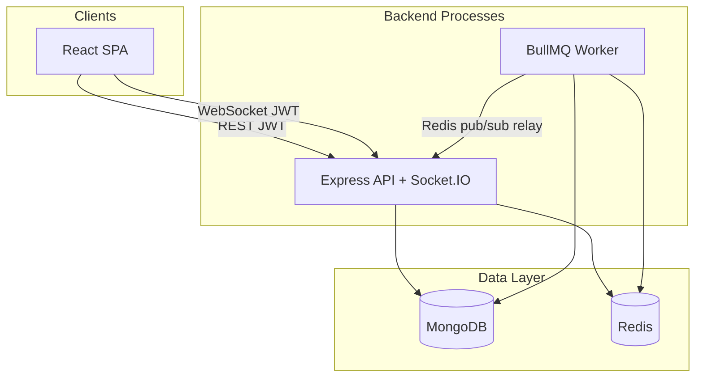
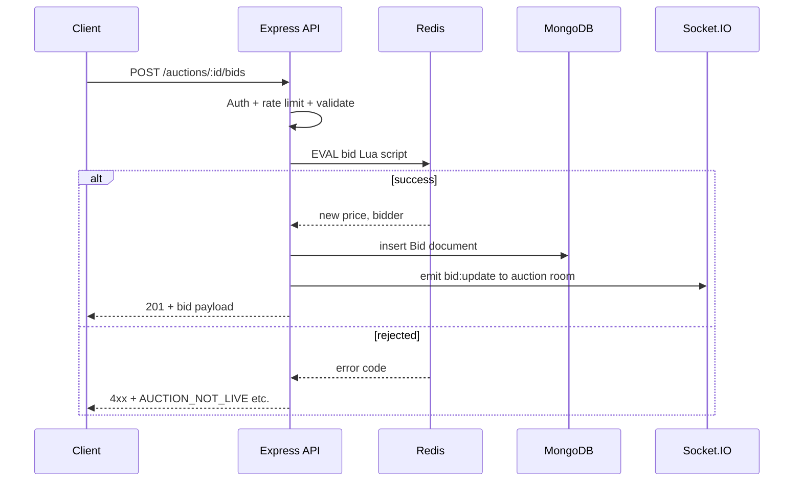
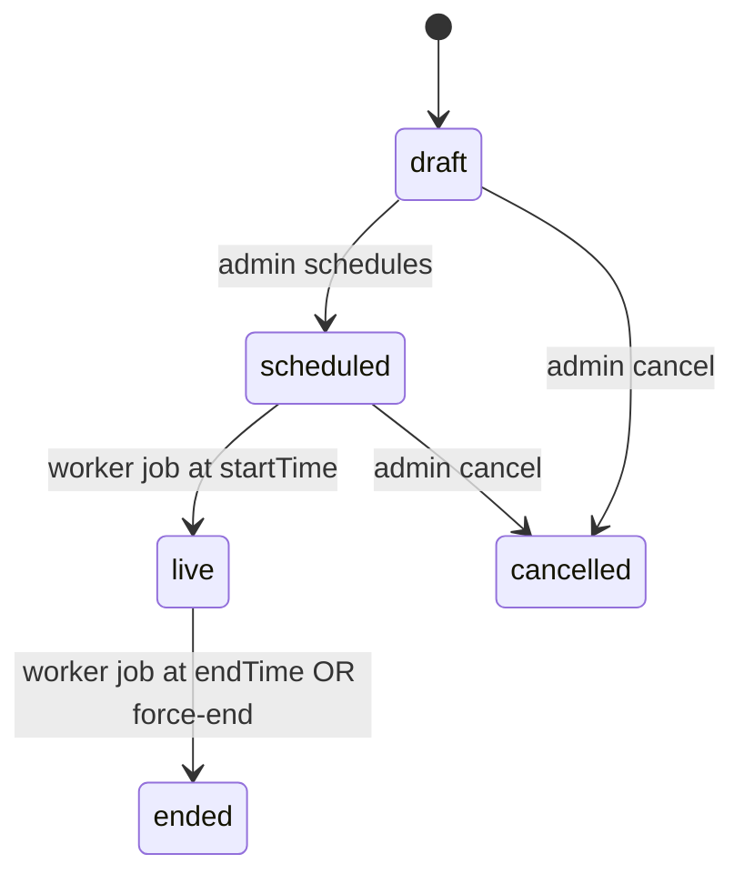

# Architecture Overview

This document describes the production architecture of the Bike Auction Platform — a modular monolith optimized for live bidding with strong consistency on the hot path and durable auditability in MongoDB.

## High-Level Diagram



## Stack

| Layer | Technology |
|-------|------------|
| Frontend | React 18, Vite, Tailwind CSS, React Query, Socket.IO client |
| API | Node.js 20, Express, TypeScript, Zod validation |
| Real-time | Socket.IO 4 with `@socket.io/redis-adapter` |
| Live state | Redis (atomic Lua bids, cache, rate limits, socket adapter) |
| Persistence | MongoDB via Mongoose (users, motorcycles, auctions, bids, audit) |
| Background jobs | BullMQ on Redis (auction lifecycle, notifications) |
| Observability | Winston, Prometheus (`prom-client`), request IDs |

## Design Principles

### Modular monolith

Domain logic lives in `backend/src/modules/` (auth, auctions, bids, watchlist, notifications, admin). A single codebase deploys as two runtime processes:

1. **API** (`server.ts`) — HTTP + WebSockets
2. **Worker** (`worker.ts`) — scheduled jobs, no public HTTP

This avoids microservice overhead while keeping clear module boundaries for future extraction.

### CQRS-lite bidding path

| Store | Responsibility |
|-------|----------------|
| **Redis** | Current price, high bidder, end time (ms), extension logic, live auction set |
| **MongoDB** | Bid history, auction documents, user records, audit trail |

Writes go to Redis first (atomic Lua script). Successful bids are persisted asynchronously to MongoDB and broadcast via Socket.IO.

### HTTP for writes, sockets for push

Bids are placed via `POST /v1/auctions/:id/bids` so every bid has:

- JWT authentication
- Optional `Idempotency-Key` header
- Rate limiting (Redis)
- Structured error codes

Socket.IO delivers `bid:update`, `auction:extended`, `auction:ended`, and `notification:new` — clients never place bids over the socket.

### Anti-sniping

When a bid arrives within the configured window before `endTime`, the Lua script extends `endTime` in Redis and emits `auction:extended`. MongoDB `endTime` is updated by the worker on auction end reconciliation.

## Request Flow — Place Bid



## Auction Lifecycle



On transition to **live**, the worker initializes Redis hash keys for the auction. On **end**, it reads final state from Redis, updates MongoDB, cleans Redis keys, and notifies watchers via Socket.IO.

## Socket.IO Rooms

| Room | Members | Events |
|------|---------|--------|
| `auction:{id}` | Users viewing an auction | `bid:update`, `auction:extended`, `auction:ended` |
| `user:{id}` | Authenticated user | `notification:new` |
| `auctions:live` | Home page subscribers | `auction:started`, `auction:ended` |
| `admin:auctions` | Admin dashboard | lifecycle + KPI refresh hints |

Clients emit `join:auction` with `{ auctionId }` and receive `auction:snapshot` with current Redis state.

Cross-process emits (worker → clients) use a Redis pub/sub **relay bridge** so only the API process owns Socket.IO connections.

## Backend Folder Layout

```text
backend/src/
├── app.ts              # Express app, routes, middleware
├── server.ts           # HTTP server + Socket.IO bootstrap
├── worker.ts           # BullMQ worker entry
├── config/             # env, database, redis, bullmq
├── middleware/         # auth, error handler, request id
├── models/             # Mongoose schemas
├── modules/
│   ├── auth/
│   ├── auctions/
│   ├── bids/
│   ├── watchlist/
│   ├── notifications/
│   └── admin/
├── redis/
│   └── auctionState.ts # Lua bid script, state init/cleanup
├── socket/             # IO setup, handlers, relay bridge
├── jobs/               # BullMQ queue definitions + processors
└── utils/              # logger, seed, helpers
```

## Frontend Folder Layout

```text
frontend/src/
├── app/           # Router, providers, layout
├── pages/         # Home, auction detail, auth, admin, etc.
├── components/    # UI primitives and feature components
├── hooks/         # useAuth, useSocket, useAuction
├── lib/           # api client, socket, types, formatters
└── styles/        # Tailwind entry
```

## Security Model

- Passwords hashed with bcrypt
- Short-lived JWT access tokens + rotating refresh tokens (httpOnly cookie optional path)
- Role-based access: `bidder` vs `admin`
- Socket handshake validates JWT before joining privileged rooms
- Helmet, CORS allowlist, input validation via Zod
- Admin mutations write to `AuditLog` collection

## Observability

See [observability.md](observability.md) for details.

- Structured JSON logs with correlation/request IDs
- Prometheus counters and histograms at `/metrics`
- `/health` and `/health/ready` for orchestrator probes
- GitHub Actions: lint, typecheck, integration tests

## Phase Status

- [x] Phase 0 — Project scaffold, Docker, README
- [x] Phase 1 — Backend foundation
- [x] Phase 2 — Authentication
- [x] Phase 3 — Domain & auction lifecycle
- [x] Phase 4 — Bidding core (Redis Lua)
- [x] Phase 5 — Real-time sockets
- [x] Phase 6 — Watchlist & notifications
- [x] Phase 7 — Frontend SPA
- [x] Phase 8 — Observability & CI
- [x] Phase 9 — Documentation & deployment
- [ ] Phase 10 — Testing (deferred)
