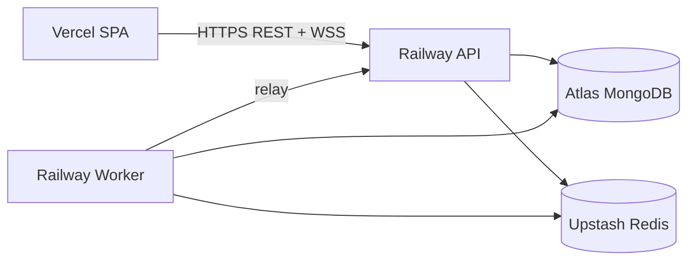

# Deployment Guide

Deploy the Bike Auction Platform using managed services. This guide covers a **low-cost production stack** suitable for internship demos and small traffic.

## Recommended Production Topology

| Component | Service | Notes |
|-----------|---------|-------|
| Frontend | **Vercel** or **Netlify** | Static SPA from `frontend/dist` |
| API | **Railway** or **Render** | Web service, port from `PORT` env |
| Worker | **Railway** or **Render** | **Separate** service, same repo, `npm run worker` |
| MongoDB | **MongoDB Atlas** | M0 free tier; database `bike_auction` |
| Redis | **Upstash Redis** | Serverless; use TLS `rediss://` URL |



> **Critical:** Run the BullMQ worker as its own process. Without it, scheduled auctions will not start/end and notifications will not fire.

---

## 1. MongoDB Atlas

1. Create a cluster (M0 is fine for demos).
2. Database name: `bike_auction` (include in connection URI path).
3. Create a DB user; store password in secrets manager.
4. Network access: allow Railway/Render egress IPs or `0.0.0.0/0` for demos (tighten for real prod).

Example URI:

```
mongodb+srv://appuser:<password>@cluster0.xxxxx.mongodb.net/bike_auction?retryWrites=true&w=majority
```

---

## 2. Upstash Redis

1. Create a regional Redis database close to your API region.
2. Copy the **TLS** connection string (`rediss://...`).
3. The backend sets `tls: {}` on ioredis when the URL scheme is `rediss`.

No extra configuration required for Socket.IO adapter or BullMQ — same Redis URL for all.

---

## 3. Backend API (Railway)

### Create project

1. Connect GitHub repo to [Railway](https://railway.app/).
2. Add a service from `backend/` directory (or set root directory to `backend`).

### Build & start

| Setting | Value |
|---------|-------|
| Build command | `npm ci && npm run build` |
| Start command | `npm start` |
| Health check path | `/health/ready` |

### Environment variables

```env
NODE_ENV=production
PORT=3001
MONGODB_URI=mongodb+srv://...
REDIS_URL=rediss://...
JWT_ACCESS_SECRET=<random 32+ chars>
JWT_REFRESH_SECRET=<random 32+ chars>
JWT_ACCESS_EXPIRES_IN=15m
JWT_REFRESH_EXPIRES_IN=7d
CORS_ORIGIN=https://your-app.vercel.app
LOG_LEVEL=info
```

Generate secrets locally:

```bash
node -e "console.log(require('crypto').randomBytes(32).toString('hex'))"
```

### Custom domain (optional)

Railway provides `*.up.railway.app`. Point a custom domain if needed; ensure `CORS_ORIGIN` matches the frontend URL exactly.

---

## 4. Backend Worker (Railway — second service)

Duplicate the backend service or add a new service from the same repo:

| Setting | Value |
|---------|-------|
| Root directory | `backend` |
| Build command | `npm ci && npm run build` |
| Start command | `npm run worker` |
| Health check | None (no HTTP) — rely on process logs |

Use the **same** `MONGODB_URI`, `REDIS_URL`, and `JWT_*` variables as the API service. Do not expose this service publicly.

---

## 5. Backend on Render (alternative)

### Web service (API)

- **Environment:** Node
- **Build:** `npm install && npm run build`
- **Start:** `npm start`
- **Health check:** `/health/ready`

### Background worker

- **Type:** Background Worker
- **Build:** `npm install && npm run build`
- **Start:** `node dist/worker.js` or `npm run worker`

Set identical env vars on both services.

---

## 6. Frontend (Vercel)

1. Import repo; set **Root Directory** to `frontend`.
2. Framework preset: **Vite**.
3. Build: `npm run build` · Output: `dist`

### Environment variables (build time)

```env
VITE_API_URL=https://your-api.up.railway.app/v1
VITE_SOCKET_URL=https://your-api.up.railway.app
```

Redeploy after changing `VITE_*` variables — they are baked into the static bundle.

### SPA routing

Vercel handles client-side routes automatically for Vite SPAs. For Netlify, add a `_redirects` file:

```
/*    /index.html   200
```

---

## 7. Frontend on Netlify

Same as Vercel: root `frontend`, build `npm run build`, publish `dist`, set `VITE_API_URL` and `VITE_SOCKET_URL`.

---

## 8. Docker deployment

Dockerfiles are in `docker/`:

| File | Purpose |
|------|---------|
| `Dockerfile.backend` | API image → `node dist/server.js` |
| `Dockerfile.worker` | Worker image → `node dist/worker.js` |
| `Dockerfile.frontend` | Multi-stage build + nginx |
| `docker-compose.full.yml` | Local full-stack demo |

Build API image:

```bash
docker build -f docker/Dockerfile.backend -t bike-auction-api ./backend
docker run -p 3001:3001 --env-file backend/.env bike-auction-api
```

Build worker image:

```bash
docker build -f docker/Dockerfile.worker -t bike-auction-worker ./backend
docker run --env-file backend/.env bike-auction-worker
```

Frontend (from repo root):

```bash
docker build -f docker/Dockerfile.frontend \
  --build-arg VITE_API_URL=https://api.example.com/v1 \
  --build-arg VITE_SOCKET_URL=https://api.example.com \
  -t bike-auction-web .
```

---

## 9. Post-deploy checklist

- [ ] `GET https://api.../health/ready` returns OK
- [ ] Worker logs show BullMQ connection
- [ ] Run seed once: `npm run seed` (from Railway shell or local against prod DB — **careful**)
- [ ] Frontend loads; login works
- [ ] Place test bid; `bid:update` appears in browser WS tab
- [ ] `CORS_ORIGIN` matches frontend URL (no trailing slash)
- [ ] WebSocket connects over `wss://` when frontend is HTTPS

---

## 10. Health checks & monitoring

Configure your platform's health probe:

| Probe | Path | Expect |
|-------|------|--------|
| Liveness | `GET /health` | 200, `{ "status": "ok" }` |
| Readiness | `GET /health/ready` | 200 only when Mongo + Redis up |

Scrape `GET /metrics` with Prometheus or a compatible agent if you add monitoring.

---

## 11. Scaling notes

| Concern | Guidance |
|---------|----------|
| Multiple API instances | Supported — Redis adapter syncs Socket.IO rooms |
| Multiple workers | Use BullMQ concurrency; avoid duplicate cron without locks |
| Redis memory | Live auction keys cleaned on end; monitor Upstash usage |
| MongoDB | Index on `auctions.status`, `bids.auctionId`, `users.email` |

For internship scope, a single API instance + single worker is sufficient.

---

## 12. CI/CD

GitHub Actions (`.github/workflows/ci.yml`) runs on push:

- Backend: install, lint, typecheck, integration tests
- Frontend: install, build

Wire Railway/Render deploy hooks to your default branch after CI passes.

---

## Local development

See [SETUP.md](SETUP.md) for Atlas + Upstash or Docker-based local setup.
